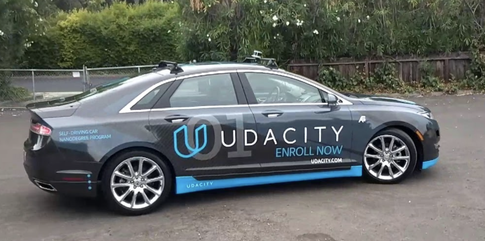

# Udacity Self-driving Car Nanodegree - System Integration



### Team Members
1. Sergiy Fefilatyev (Github: [sfefilatyev](https://github.com/sfefilatyev/))
2. Dmitriy Litvak (Github: [dlitvak](https://github.com/dlitvak/))
3. Devdatta Gangal (Github: [devdatta-work](https://github.com/devdatta-work/))
4. Reheman Baikejiang (Github: [bakijan](https://github.com/bakijan/))
5. Devunuri Sai Praneeth (Github: [saipraneethd](https://github.com/saipraneethd))

### Goal
The rubrik of the Capstone project is quite straightforward - did the car navigate the track successfully? The submitted code must work successfully to navigate Carla around the test track.

### Architecture


We follow the architecture as prescribed in the class instructions. The project runs with [ROS](http://www.ros.org/) and is divided into the following modules :
 - `tl_detector` uses the camera to detect the traffic lights' color
 - `twist_controller` handles the control of the car
 - `waypoint_follower` makes sure the car follow the trajectory
 - `waypoint_loader` loads the route the car is going to follow
 - `waypoint_updater` adapts the car's route to the situation (eg. traffic light)

### Results
1. Runs successfully on the Highway (Simulator)

Video insert
2. Runs successfully on the Test Lot (Simulator)

3. Carla drives successfully with our code
Video Insert


### Installation instructions
* VM & Simulator Installation
    1. We use the Udacity provided virtual machine with ROS (Kinetic - 1.12.14) and Dataspeed DBW already installed - settings at 2CPU, 2GB system memory and 25GB free space
    2. Simulator Downloaded the [Udacity Simulator[(https://github.com/udacity/CarND-Capstone/releases)] on the client machine.  It works best in the "simple" version at 640 x 480


* Port Forwarding
We looked up the instructions from [the course (3. Getting Started) here](https://s3-us-west-1.amazonaws.com/udacity-selfdrivingcar/files/Port+Forwarding.pdf) for port forwarding

* Changes to the Requirements.txt
While debugging camera topic we stumbled on a the following bug:
https://github.com/udacity/CarND-Capstone/issues/147 We locally updated our requirements.txt with Pillow pointing to version 4.3 to address dependencies. This change is not part of the current submission due to strict guidance in this project for dependencies for Carla. However, for all other deployments we suggest to change Pillow library requirement to 4.3.

* Real world testing (will be updated)
See below


### Other Issues we ran into
1. When we were on Docker installation, Requirements.txt was modified to point pillow to version 4.3 (see above).  We had an issue with cv.Bridge that was traced back to https://github.com/udacity/CarND-Capstone/issues/147.  This required upgrade to pillow version 4.3 - however this worked well for Workspace and native installation
    1. We do want to call out that while you mention not to change the requirements.txt, you have used different kinds of settings yourself in the Virtual Workspace
    2. This has caused a lot of confusion and wasted time
2. We also had to use CUDA v9.0, and not v8.0 as required
3. We also had to use Driver 4.15, and not 3.XX not as required.
4. We ran into issues with the car’s deceleration.  We observed crazy jerk after detection of the stop-light.  Seeking inspiration from  https://github.com/justinlee007/CarND-Capstone we adjusted the waypoints to ensure that the velocity was under the maximum possible velocity as given by v*v=2aS where a = deceleration and S = distance until the stop-line.
    1. The maximum deceleration chosen was 0.5m/s*s initially.
    2. The issue still persisted because the car now had a discrete drop in velocity for the first waypoint where correction needs to happen
    3. We worked on many different solutions only to realize later that this behavior is consistent with physics.  
    4. The first thing we changed was to tolerate higher deceleration (now changed to 5m/s*s which is 0.5G significantly less than 2G which is considered hard braking in industry)
    5. Second thing we explore was to increase the lookahead from 50 waypoints to 100
5. We also stumbled upon the “SteeringReport” issue (https://knowledge.udacity.com/questions/46645). The current install of DBW breaks because the steering_wheel_angle_cmd d field, which is populated in bridge.py no longer exists, and we had to update locally code in Bridge-node to address issue described in udacity/CarND-Capstone#296. This results in field steering_wheel_angle_cmd changed to steering_wheel_angle inside SteeringReport structure.
6. We also observed Latency between ROS & simulator when camera is turned on. This issue has been reported multiple times, but seems to be unaddressed by Udacity. The issue is described in udacity/CarND-Capstone#266 . The issue affects both, provided Workspace and Docker environment. It did not seem to affect the virtual machine environment. It did not affect native installation.


### Insights on Traffic Light Classification (TLC) with Single Shot Multibox Detector (SSD)
*Disclaimer: Due to limited time and GPU resources, we borrowed a fully trained model from another team. We have also learned how to train a model using [Object Detection Model Zoo](https://github.com/tensorflow/models/blob/r1.5/research/object_detection/g3doc/detection_model_zoo.md) from the same group's [tutorial](https://github.com/alex-lechner/Traffic-Light-Classification/blob/master/README.md), for which we are very grateful.*

#### TLC Intro
The goal of TLC was to train a model for quick classification of the traffic lights in the simulator environment and in Carla autonomous driving vehicle in the real Udacity parking lot.

#### TLC Implementation
After a quick Google search and reviewing the Object Detection Lab in the Udacity lectures, we realized that we would not have to train our model from scratch. There's already a large library of object detection models hosted by Tensorflow and contributed by Google [link](https://github.com/tensorflow/models/tree/r1.5/research/object_detection). We chose SSD model based on the report by Alex Lechner group that this was the optimal model for them.

**Figure: SSD Model**


We decided adopt their ([model](https://github.com/alex-lechner/Traffic-Light-Classification/tree/master/models)) to put the whole pipeline together.

Due to the lack of time, we skipped the data generation and labeling by borrowing the group's TFRecord files [link](https://github.com/alex-lechner/Traffic-Light-Classification/blob/master/README.md#1-the-lazy-approach).

### Insights on other things
* Traffic Light detector
* Twist Controller
* Waypoint Follower
* Waypoint Loader
* Waypoint Updater


### Other instructions
* Real world testing instructions
1. Download [training bag](https://s3-us-west-1.amazonaws.com/udacity-selfdrivingcar/traffic_light_bag_file.zip) that was recorded on the Udacity self-driving car.
2. Unzip the file
```bash
unzip traffic_light_bag_file.zip
```
3. Play the bag file
```bash
rosbag play -l traffic_light_bag_file/traffic_light_training.bag
```
4. Launch your project in site mode
```bash
cd CarND-Capstone/ros
roslaunch launch/site.launch
```
5. Confirm that traffic light detection works on real life images
