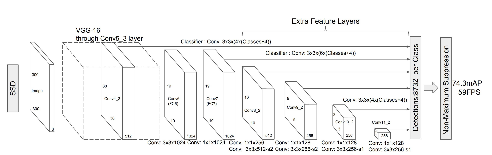
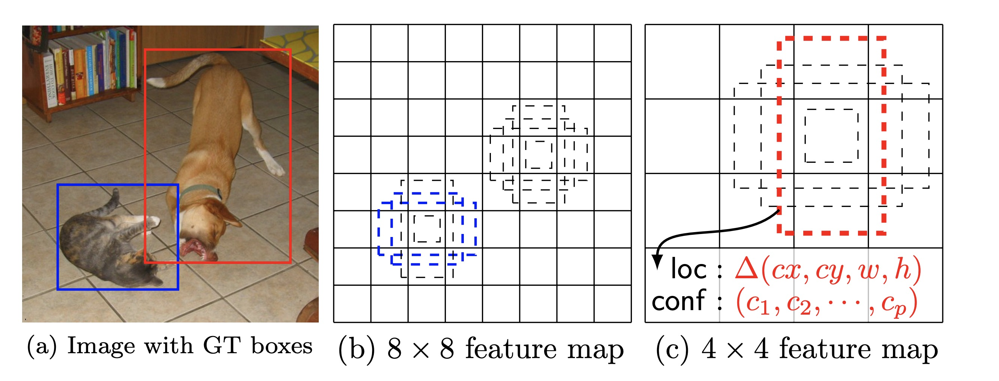
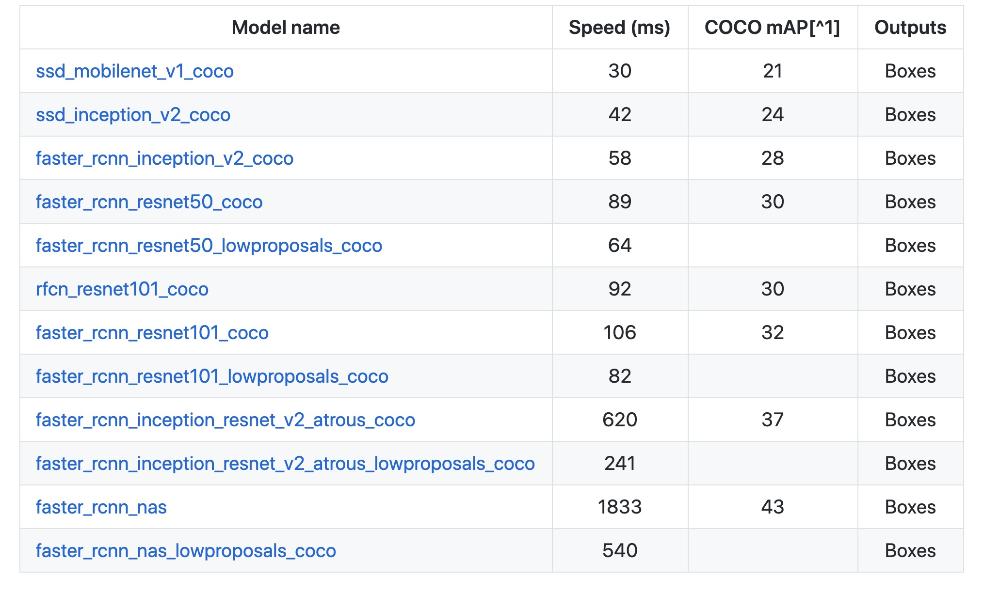
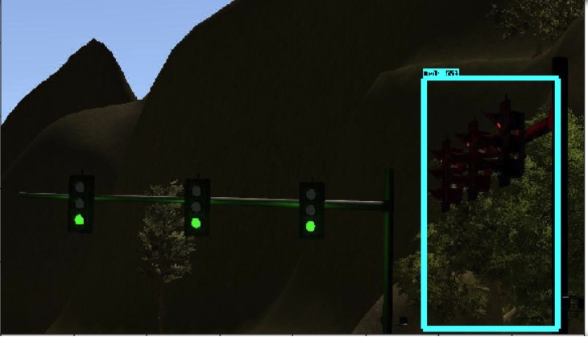

## Traffic Light Classification (TLC) with Single Shot Multibox Detector (SSD)

_Disclaimer: Due to limited time and GPU resources, we borrowed a fully trained [model](https://github.com/alex-lechner/Traffic-Light-Classification/tree/master/models)
 from another team. We skipped the data generation and labeling by borrowing the group's TFRecord files 
 [link](https://github.com/alex-lechner/Traffic-Light-Classification/blob/master/README.md#1-the-lazy-approach).  We have also learned how to 
train a model using [Object Detection Model Zoo](https://github.com/tensorflow/models/blob/r1.5/research/object_detection/g3doc/detection_model_zoo.md)
from the same group's [tutorial](https://github.com/alex-lechner/Traffic-Light-Classification/blob/master/README.md), 
for which we are very grateful._

### TLC Intro

The goal of TLC was to train a model for quick classification of the traffic lights in the simulator environment and in
Carla autonomous driving vehicle in the real Udacity parking lot.

### TLC Implementation

After a quick Google search and reviewing the Object Detection Lab in the Udacity lectures, we realized that 
we would not have to train our model from scratch.  There's already a large library of object detection models hosted by 
Tensorflow and contributed by Google [link](https://github.com/tensorflow/models/tree/r1.5/research/object_detection).
We chose SSD model based on the report by Alex Lechner group that this was the optimal model for them.

**Figure:  SSD Model** 

SSD is end-to-end model [ref](https://arxiv.org/pdf/1512.02325.pdf), meaning it is trained to detect and classify an object in the picture
at the same time.  SSD is a CNN built on the base of VGG16. It accepts images of any size and uses kernels to scan them for features at different
levels of detail.  SSD gradually shrinks the feature map size and increase the depth as it goes to the deeper layers. 
The deep layers cover larger receptive fields and construct more abstract representation, while the shallow layers cover 
smaller receptive fields.  SSD uses shallow layers to predict small/further objects and deeper layers to predict big objects.
As can be seen in the diagram above, the result of these predictions at different levels are a bunch of bounding boxes.
The boxes are combined around the object into a single bounding box which is output together with the object classification.

**Figure:  SSD Feature Layer Boxes** 

We decided to adopt another group's ([model](https://github.com/alex-lechner/Traffic-Light-Classification/tree/master/models)) 
just to try the whole pipeline together.  As we found out, that model turned out to be too slow in a simulator working on CPU.
It took 1-1.5 second to classify a single image posted to _/image_color_ topic.  Because the Udacity skeleton code was calling the TLClassifier 
for every image, TLDetector thread was lagging behind trying to post every light detection to _/traffic_waypoint_ topic.
To deal with this issue, we introduced *tl_detector_rate* and *tl_start_detection_distance* properties in [yaml config](ros/src/tl_detector/sim_traffic_light_config.yaml).
*tl_detector_rate* sets number of times per second the images are classified (at least 3 detections have to happen to publish to _/traffic_waypoint_ topic).
*tl_start_detection_distance* sets the distance before the next published traffic light stop line at which the classifier is getting invoked. 
It might be a bit tricky to pick a good set of parameters based on the host machine CPU speed.  We have not implemented the code to do this based on the system properties.
Those parameters are less important when running on a powerful GPU; though, it might be a good idea to adjust them to save some cycles.
For e.g., the default *tl_start_detection_distance* of 100 m. means that TLClassifier works all the time in the parking lot.

We have spent some time researching our own model to train as well.  Looking at the 
[Model Zoo]((https://github.com/tensorflow/models/blob/r1.5/research/object_detection/g3doc/detection_model_zoo.md)), we noticed
the mobilenet as the next best model.

**Figure: Model Zoo Stats**

The Speed column is the duration of inference on the researcher's GPU.  _mAP_ refers to the accuracy of the inference.
So, while *ssd_mobilenet_v1_coco* model lost 12.5% in accuracy compared to *ssd_inception_v2_coco*, it gained 29% in speed.  

As the model we adopted from the other group seemed to have plenty of accuracy, we set out to train the mobilenet model for 20K
steps.  Unfortunately, after training for many hours in Udacity workspace, we found that the accuracy on the test set was too low.
While some images were classified correctly, other were missed or completely misclassified.

Running out of time we settled on using Alex Lechner group's model.  You can find our own exploits training mobilenet at our [repo](https://github.com/dlitvak/TL_Classifier)
